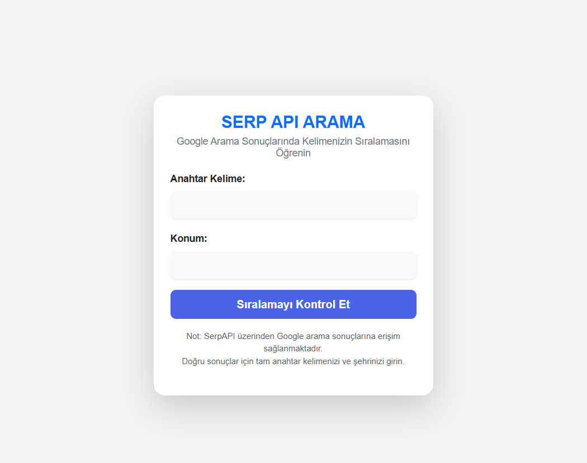

# Laravel SerpAPI Project

Bu proje, **SerpAPI** kullanarak Google arama sıralamalarını almak ve göstermek için geliştirilmiş bir Laravel uygulamasıdır. Proje, bir **case çalışması** olarak geliştirilmiştir.

## Proje Özeti

Bu uygulama, kullanıcının belirlediği anahtar kelimelere göre Google arama sonuçlarını alır ve sıralama sonuçlarını kullanıcıya sunar. **SerpAPI** servisi kullanılarak bu veriler çekilmiştir.

## Teknolojiler

- Laravel (PHP Framework)
- SerpAPI
- Bootstrap (Frontend için)

Projenizi çalıştırmak için önce **SerpAPI API anahtarına** sahip olmanız gerekmektedir.

> **Not:** SerpAPI API anahtarını almak için [serpapi.com](https://serpapi.com/) adresine gidin, bir hesap oluşturun ve API anahtarınızı Dashboard'dan alın.

## Ekran Görüntüleri

### 1. Ana Sayfa

### 2. Arama Sonuçları

